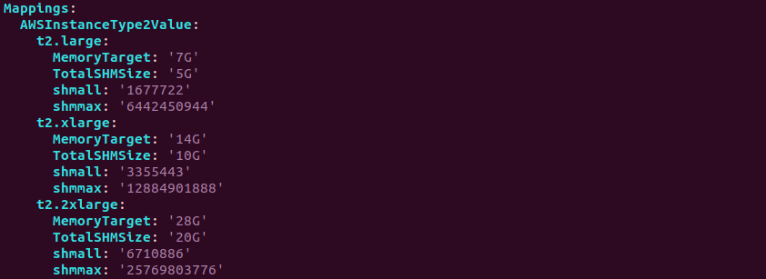

//Include any predeployment steps here, such as signing up for a Marketplace AMI or making any changes to a partner account. If there are no predeployment steps, leave this file empty.

== Predeployment steps

=== Specialized knowledge

This deployment requires a moderate level of familiarity with
AWS services. If you’re new to AWS, see https://aws.amazon.com/getting-started/[Getting Started Resource Center^]
and https://aws.amazon.com/training/[AWS Training and Certification^]. These sites provide materials for learning how to design,
deploy, and operate your infrastructure and applications on the AWS Cloud.

=== AWS account

If you don’t already have an AWS account, create one at https://aws.amazon.com/[https://aws.amazon.com^] by following the on-screen instructions. Part of the sign-up process involves receiving a phone call and entering a PIN using the phone keypad.

Your AWS account is automatically signed up for all AWS services. You are charged only for the services you use.

=== Technical requirements

Before you launch the Quick Start, review the following information and ensure that your account is properly configured. Otherwise, deployment might fail.

==== Resource quotas

This Quick Start deployment currently requires following resources by default. You might need to request increases if the Quick Start deployment requires more resources than the default quotas.

The https://console.aws.amazon.com/servicequotas/home?region=us-east-2#!/[Service Quotas console^] displays your usage and quotas for services currently in use.
For more information, see https://docs.aws.amazon.com/servicequotas/latest/userguide/intro.html[What is Service Quotas?^] and https://docs.aws.amazon.com/general/latest/gr/aws_service_limits.html[AWS service quotas^].

|===
|Resource |This deployment uses

|VPCs |1
|Elastic IP addresses |3
|AWS Identity and Access Management (IAM) |1
|Auto Scaling groups |1
|t3.micro instances |1
|t3.xlarge instances |3
|===

==== Supported AWS Regions

[cols=3*,options="header"]
|===
|Code
|Name
| Opt-in Status

|ap-northeast-1 |Asia Pacific (Tokyo)   |Not required
|ap-northeast-2 |Asia Pacific (Seoul)   |Not required
|ap-northeast-3 |Asia Pacific (Osaka-Local) |Not required
|ap-southeast-1 |Asia Pacific (Singapore)   |Not required
|ap-southeast-2 |Asia Pacific (Sydney)  |Not required
|ap-south-1 |Asia Pacific (Mumbai)  |Not required
|ca-central-1   |Canada (Central)   |Not required
|eu-central-1   |Europe (Frankfurt) |Not required
|eu-west-1  |Europe (Ireland)   |Not required
|eu-west-2  |Europe (London)    |Not required
|eu-west-3  |Europe (Paris) |Not required
|eu-north-1 |Europe (Stockholm) |Not required
|sa-east-1  |South America (São Paulo)  |Not required
|us-east-1  |US East (N. Virginia)  |Not required
|us-east-2  |US East (Ohio) |Not required
|us-west-2  |US West (Oregon)   |Not required
|===

TIP: Certain Regions are available on an opt-in basis. For more information, see https://docs.aws.amazon.com/general/latest/gr/rande-manage.html[Managing AWS Regions^].

==== EC2 key pairs

Make sure that at least one Amazon ES2 key pair exists in your AWS account in the region where you plan to deploy the Quick Start. Make note of the key pair name, as you need it during deployment. To create a key pair, see Amazon EC2 key pairs and Linux instances.

For testing or proof-of-concept (PoC) purposes, we recommend creating a new key pair instead of using one that’s already being used by a production instance.

==== IAM permissions

Before launching the Quick Start, you must sign in to the AWS Management Console with IAM permissions for the resources that the templates deploy. The _AdministratorAccess_ managed policy within IAM provides sufficient permissions, although your organization may choose to use a custom policy with more restrictions. For more information, see https://docs.aws.amazon.com/IAM/latest/UserGuide/access_policies_job-functions.html[AWS managed policies for job functions^].

=== Tibero 6 Edition

This Quick Start requires Tibero 6 Enterprise Edition. Tibero 6 ensures high availability, stability, and compatibility with customized high performance DBMS that can be used in any cloud environment. It improves data efficiency and safety with enforced TSC technology as well as TAC, which has been successfully developed world’s second Active Clustering technology. (For more information about {partner-product-short-name} TAC, refer to AWS Marketplace.)  The Quick Start deploys TAC infrastructure, which provides better performance and file management.
{partner-product-short-name} TSC supports automatic file management and data striping across multiple EBS volumes, providing high performance and an easy way to scale your storage area.

=== Operating System for Deployment

You can use Linux for {partner-product-short-name} Database installation on AWS. The Quick Start deployment uses Linux and supports Red Hat Enterprise Linux (RHEL) version 8.2.

=== Tibero Memory Configuration
{partner-product-short-name} Quick Start maps each EC2 Instance type to a Tibero SGA size in megabytes (60% of available RAM in the EC2) and SHMMAX kernel (75% of available memory). This Quick Start provides default settings that you can see and revise in the Mappings section of the AWS CloudFormation template.

[#architecture2]

